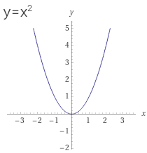

## Functions
---

#### Function
_Definitions_
> Relation between set A and set B is a function iff each element from A is associated to exactly one element of B.
> A function is an ordered triplet ⟨A,B,G⟩ where A and B are sets, and G is a subset of A×B, such that for each a∈A there's a single b∈B that satisfies ⟨a,b⟩∈G.  
> A is domain (תחום), B is codomain (טווח), and G is graph.
> Denoted: 𝒇(x)=y ⟺ ⟨x,y⟩∈𝒇 // y is x's image (תמונה / דמות)
> A function is a subset of A×B that satisfies:
> - for all x∈X there's a y∈Y such that ⟨x,y⟩∈𝒇
> - for all x∈X, y1,y2∈Y if (⟨x,y1⟩∈𝒇 and ⟨x,y2⟩∈𝒇 → y1=y2)

_Examples_
- 
    - Function: 𝒇=⟨[-2,2], [0,5], {⟨x,x**2⟩|x∈[-2,2]}⟩
    - Domain: D(𝒇)=[-2,2]
    - Range: Ra(𝒇)=[0,5]  
    - Graph: G(𝒇)={⟨x,x**2⟩|x∈[2,−2]} // graph dictates domain, doesn't dictate range
    - 𝒇(2)=4 and 𝒇(−2)=4 // 4 is the image of 2,−2; and 2,−2 are מקורות of 4

_Note_
- Not all elements in Ra(𝒇) are an image of some element in D(𝒇) // lesson8 00:09:38