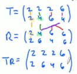
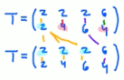

%ignore and
#### 𝑹: {⟨x,y⟩ for ⟨x,y⟩ ∈ A2 if x𝑹y}   

#### 𝑻*𝑹: {⟨a,c⟩ | ∃b ∈ B (⟨a,b⟩ ∈ 𝑻 ∧ ⟨b,c⟩ ∈ 𝑹)}   
  

#### 𝑹2: a𝑹2c ⟺ {⟨a,c⟩ | ∃b ∈ A (⟨a,b⟩ ∈ 𝑹 ∧ ⟨b,c⟩ ∈ 𝑹)}  
an ordered pair ⟨a,c⟩∈𝑹2 means there's a "middle" b∈B that satisfies ⟨a,b⟩∈𝑹 and ⟨b,c⟩∈𝑹  
  

examples
- (a=−b)2 = 𝗜ℝ
- ⟨a,b⟩ ∈ 𝑹2 ⟺ ⟨a,c⟩,⟨c,b⟩ ∈ 𝑹

#### Empty ∅A: 𝑹:=relation(A×B) = ∅
No pair in A×B satisfies ⟨a,b⟩ ∈ 𝑹
properties  
- 𝑺·∅A = ∅
- symmetric and anti-symmetric ?

examples
- {⟨x,y⟩ ∈ ℕ2 | x+y﹤x}

#### Identity 𝗜A
properties  
- 𝑹·𝗜A = 𝑹

#### Reflexivity: 𝑹:=relation(A) is reflexive if ∀a ∈ A(⟨a,a⟩ ∈ 𝑹)  
𝑹 is reflexive if every a \in A satisfies ⟨a,a⟩∈𝑹. In other words:   
𝗜A ⊆ 𝑹  
A = { -1, 0, 1 }. Is ⋱ contained \in 𝑹?
properties  
- ⟺ 𝑹−1 is reflexive
- → 𝑹 ⊆ 𝑹2 (and 𝑹2 is reflexive)
- → 𝑹⊆𝑹2
- if 𝑺⊆𝑹 then 𝑺 is reflexive
- if 𝑺 is reflexive then both 𝑹∪𝑺 and 𝑹∩𝑺 are reflexive
examples
- 𝗨A: ∀a ∈ A(⟨a,a⟩ ∈ A×A = 𝗨A)
- 𝗜A: ∀a ∈ A(⟨a,a⟩ ∈ {⟨−1, −1⟩, ⟨0, 0⟩, ⟨1, 1⟩})
- ≤, ≥ // both contain ⋱
counter examples
- ≠ (which is 𝗨A − 𝗜A)
- <, >, ∅A
- a=−b ⋰

#### Anti-Reflexivity: 𝑹:=relation(A) is anti-reflexive iff ¬∃a ∈ A(⟨a,a⟩ ∈ 𝑹)  
𝑹 is reflexive if every a \in A satisfies ⟨a,a⟩ ∉ 𝑹. In other words:
𝗜A ∩ 𝑹 = ∅ // just 𝗜A ⊈ 𝑹 isn't enough; 𝗜A = {⟨1,1⟩, ⟨2,2⟩} ⊈ 𝑹 = {⟨1,1⟩, ⟨1,2⟩} but ⟨1,1⟩ ∈ 𝑹 so isn't anti-reflexive
examples
- ≠, <, >, ∅A
counter examples
- 𝗨A, 𝗜A, a=−b ⋰, ≤, ≥

#### Symmetry: 𝑹:=relation(A) is symmetric iff 𝑹 = 𝑹−1  
𝑹 is symmetric if every ⟨x,y⟩ \in 𝑹 satisfies ⟨y,x⟩ ∈ 𝑹 // assuming both x and y exist \in A
∀x∀y((x,y) ∈ 𝑹 → (y,x) ∈ 𝑹)

properties
- if 𝑺 is symmetric then both 𝑹∪𝑺 and 𝑹∩𝑺 are reflexive
- if 𝑺 is symmetric then 𝑹\𝑺 is symmetric
examples
- ∅A // can't point at ⟨x,y⟩ and say ⟨y,x⟩ is \not \in ∅−1
- 𝗨A, 𝗜A, a=−b ⋰, ≠
counter examples
- ≤, ≥, <, >

#### Anti-Symmetry: 𝑹:=relation(A) is anti-symmetric iff 𝑹 ∩ 𝑹−1 = ∅
𝑹 is anti-symmetric if every ⟨x,y⟩ \in 𝑹 satisfies ⟨y,x⟩ ∉ 𝑹
∀x∀y((x,y) in 𝑹 → (y,x) ∉ 𝑹)
𝑹 ∩ 𝑹−1 = ∅ means there can't be a ⟨x,x⟩

properties
- → 𝑹 is anti-reflexive
- → 𝑹−1 is anti-symmetric
- if 𝑺⊆𝑹 then 𝑺 is anti-symmetric
- if 𝑺u𝑻 is anti-symmetric then both 𝑺 and 𝑻 are anti-symmetric
- → 𝑹n𝑺 is anti-symmetric

examples
- <, >, ∅A
- b﹥a**2

counter examples  
- ≠, ≤, ≥, 𝗨A, 𝗜A, a=−b ⋰, ≠
- b﹤a**2 // <3,4> and <4,3> are symmetric

#### Weak Anti-Symmetry: 𝑹 ∩ 𝑹−1 ⊆ 𝗜A  
∀x∀y(⟨x,y⟩ ∈ 𝑹 ∧ ⟨y,x⟩ ∈ 𝑹 → x=y)
if both ⟨x,y⟩ ∈ 𝑹 and ⟨y,x⟩ ∈ 𝑹 it's only because they're equal
for x,y in A: if x≠y and ⟨x,y⟩ ∈ 𝑹 then must ⟨y,x⟩ ∉ 𝑹

AS vs WAS: AS requires every pair's opposite to \not be \in 𝑹, whereas WAS requires the same only for pairs that x=y

examples
- 𝗜A

#### Transitivity: 𝑹2 ⊆ 𝑹
∀x∀y∀z((𝑹(x,y) & 𝑹(y,z)) -> 𝑹(x,z))
Every (x,y,z) in A that satisfy ⟨x,y⟩ ∈ 𝑹 and ⟨y,z⟩ ∈ 𝑹 also satisfy ⟨x,z⟩ ∈ 𝑹
If you see an x that leads to y that leads to z, then expect x to lead to z // this is why 𝑹2 ⊆ 𝑹

properties
- if 𝑻 is symmetric and anti-symmetric then it's also transitive
examples
- A={1,2,3}; 𝑹 = {⟨__1__,2⟩, ⟨2,__3__⟩, __⟨1,3⟩__} ⇒ 𝑹2 = {⟨1,3⟩} ⊆ 𝑹
- A={1,2,3}; 𝑻 = {⟨1,2⟩} ⇒ 𝑻2 = ∅ ⊆ 𝑻
- 𝑾 = {⟨1,1⟩} ⇒ 𝑾2 = {⟨1,1⟩} ⊆ 𝑾
- 𝗜A
- ∅A
- 𝗨A // if ⟨a,b⟩ ∈ A2 and ⟨b,a⟩ ∈ A2 then ⟨a,c⟩ ∈ A2
- if |A|﹥1 then ≠ is trans
- <, ≤

counter examples
- 𝑷={⟨1,2⟩, ⟨2,1⟩} ⇒ 𝑷2 = {⟨1,1⟩, ⟨2,2⟩} ⊈ 𝑷 // iow: 1 leads to 2 leads to 1, but <1,1> ⊈ 𝑷
- ∃x∃y∃z(𝑹(x,y) ∧ 𝑹(y,z) ∧ ¬𝑹(x,z))

------

#### Equivalance: 𝑹 over A is equivalence iff R is reflexive, symmetric and transitive
examples
- 𝗨A, 𝗜A, equality
- "Has the same absolute value" on the set of real numbers
- if A=∅ then ∅A is symmetric, transitive and reflexive

counter examples
- ≥ // reflexive and transitive but \not symmetric
- if A≠∅ then ∅A is symmetric and transitive, but \not reflexive

#### Partial Order:
properties
- reflexive, antisymmetric, and transitive

examples
- equality

#### Partition of A is a set of non-empty, non-overlapping subsets of A whose \union = A
properties
- every a∈A is \in exactly one block
- no block contains ∅
- \union of blocks = A
- \intersection of any two blocks = ∅
- -> A is finite => rank of P is |X| − |P| ?

examples
- {A} is partition of A // trivial
- ∅'s only partition is ∅
- {1,2,3} has five partitions: {{1},{2},{3}}, {{1, 2}, {3}}, {{1, 3},{2}}, {{1},{2, 3}}, {{1, 2, 3}}

counter examples:
- \not partitions of {1,2,3}: 
  - {{}, {1,3}, {2}} // contains ∅
  - {{1, 2}, {2, 3}} // 2 exists in more than one block
  - {{1}, {2}} // no block contains 3
